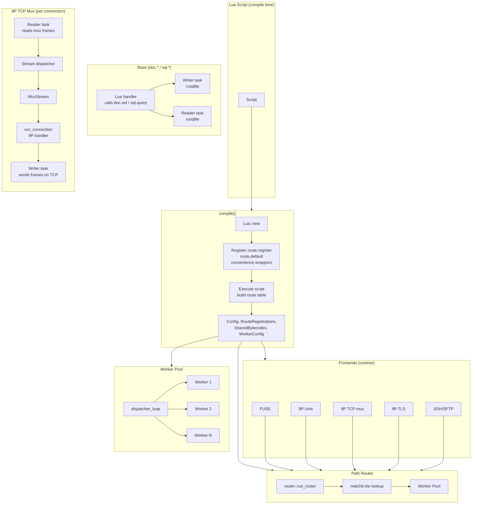
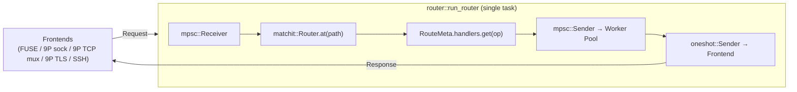
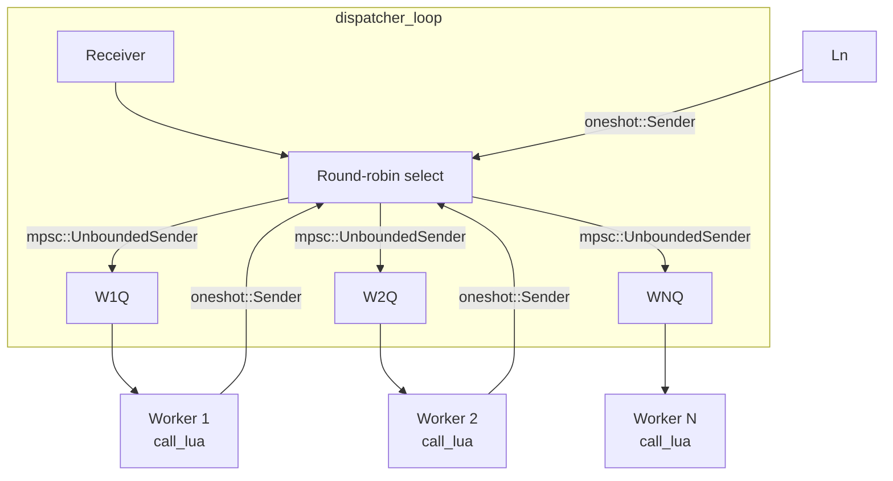
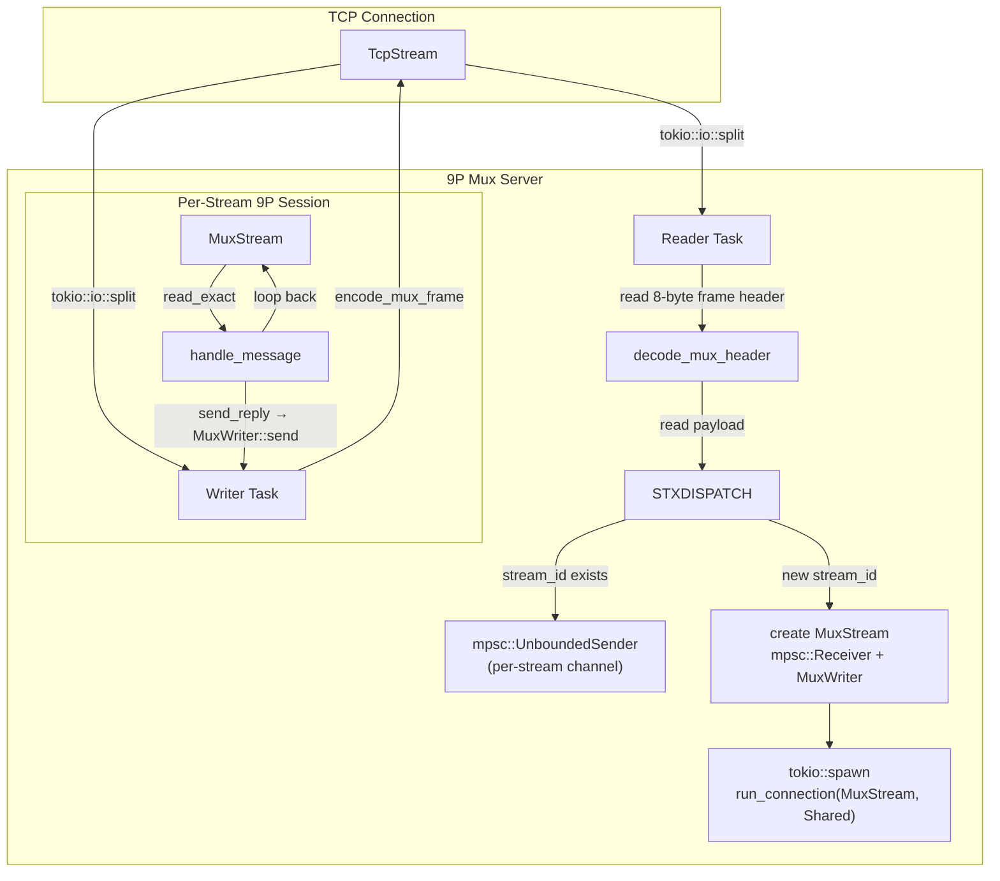
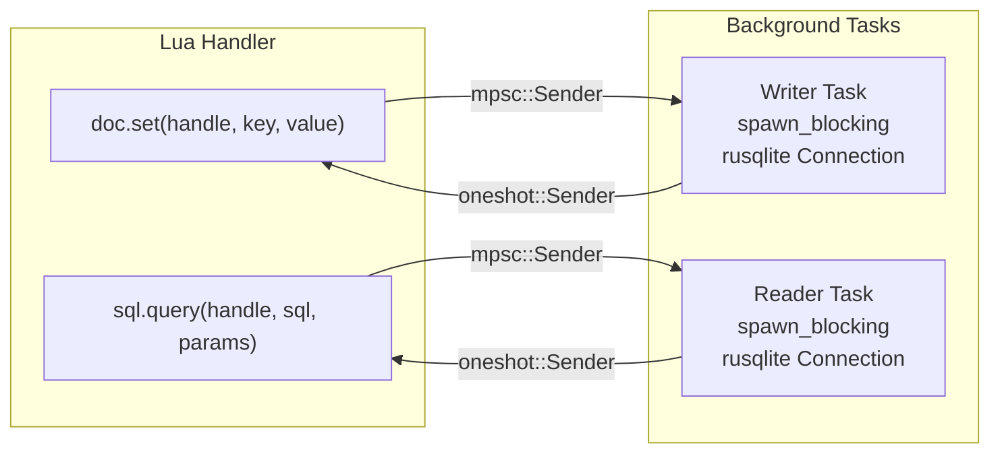
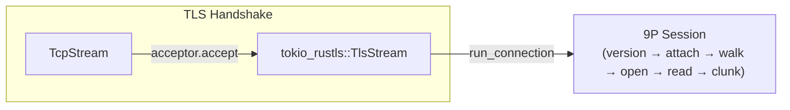
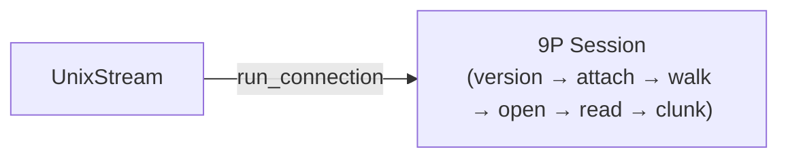
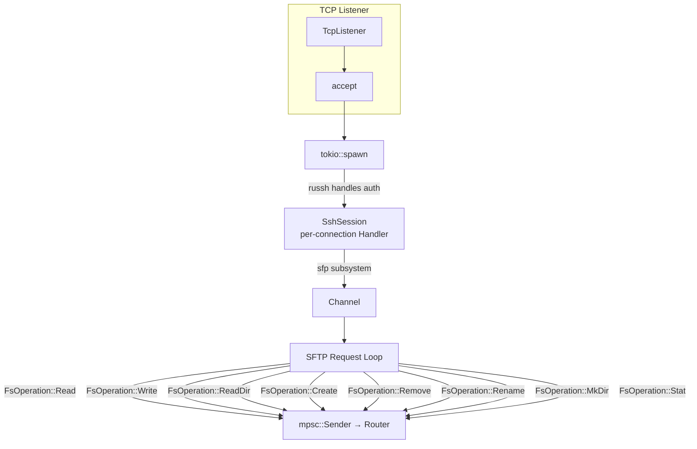
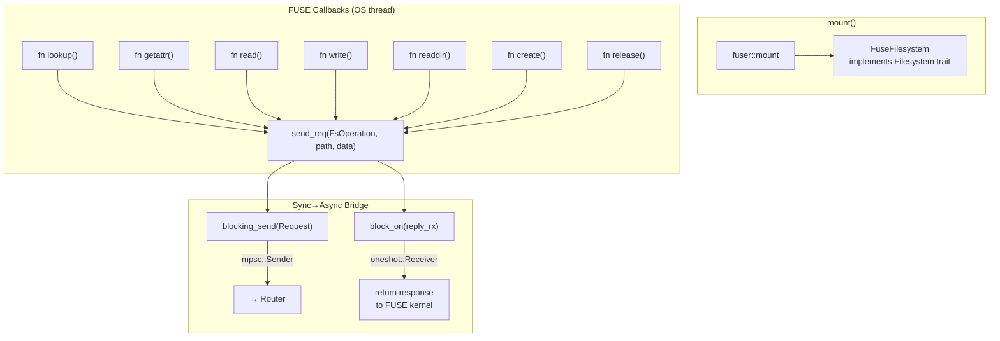

---

## Component Details

### Path Router

### Worker Pool

### 9P TCP Mux (per connection)

### Store (doc.* / sql.*)

### 9P TLS (per connection)

### 9P Unix Socket (per connection)

### SSH/SFTP (per connection)

### FUSE (per mount point)

