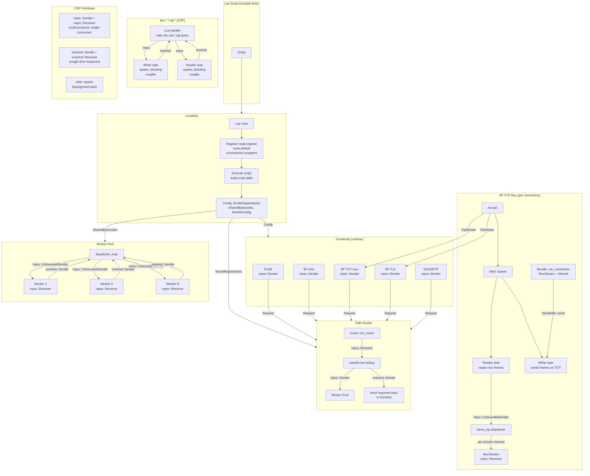

```mermaid
flowchart TB
    subgraph Lua["Lua Script (compile time)"]
        S[Script]
    end

    subgraph Compile["compile()"]
        C[Lua::new] --> CR[Register route.register\nroute.default\nconvenience wrappers]
        CR --> CS[Execute script\nbuild route table]
        CS --> CF[Config, RouteRegistrations,\nSharedBytecodes, WorkerConfig]
    end

    subgraph Frontend["Frontends (runtime)"]
        FUSE[FUSE\nmpsc::Sender<Request>]
        P9S[9P Unix\nmpsc::Sender<Request>]
        P9T[9P TCP mux\nmpsc::Sender<Request>]
        P9L[9P TLS\nmpsc::Sender<Request>]
        SSH[SSH/SFTP\nmpsc::Sender<Request>]
    end

    subgraph Mux["9P TCP Mux (per connection)"]
        direction TB
        ACC[Accept] --> SPAWN["tokio::spawn"]
        SPAWN --> READER["Reader task\nreads mux frames"]
        SPAWN --> WRITER["Writer task\nsends frames on TCP"]
        READER -->|mpsc::UnboundedSender| STXDISPATCH["serve_tcp dispatcher"]
        STXDISPATCH -->|per-stream channel| MUXS["MuxStream\nmpsc::Receiver"]
        BUNDLE["Bundle: run_connection\nMuxStream + Shared"] -->|MuxWriter::send| WRITER
    end

    subgraph Router["Path Router"]
        direction TB
        RR[router::run_router] -->|mpsc::Receiver<Request>| MATCH["matchit trie lookup"]
        MATCH -->|mpsc::Sender<HandlerRequest>| WH["Worker Pool"]
        MATCH -->|oneshot::Sender| RESP["send response back\nto frontend"]
    end

    subgraph Workers["Worker Pool"]
        direction TB
        DISPATCH["dispatcher_loop"] -->|mpsc::UnboundedSender| W1[Worker 1\nmpsc::Receiver]
        DISPATCH -->|mpsc::UnboundedSender| W2[Worker 2\nmpsc::Receiver]
        DISPATCH -->|mpsc::UnboundedSender| WN[Worker N\nmpsc::Receiver]
        W1 -->|oneshot::Sender| DISPATCH
        W2 -->|oneshot::Sender| DISPATCH
        WN -->|oneshot::Sender| DISPATCH
    end

    subgraph Store["doc.* / sql.* (CSP)"]
        direction TB
        LUA_CALL[Lua handler\ncalls doc.set / sql.query] -->|mpsc| WT[Writer task\nspawn_blocking\nrusqlite]
        LUA_CALL -->|mpsc| RT[Reader task\nspawn_blocking\nrusqlite]
        WT -->|oneshot| LUA_CALL
        RT -->|oneshot| LUA_CALL
    end

    S --> Compile
    CF -->|SharedBytecodes| Workers
    CF -->|RouteRegistrations| Router
    CF -->|Config| Frontend

    FUSE -->|Request| Router
    P9S -->|Request| Router
    P9T -->|Request| Router
    P9L -->|Request| Router
    SSH -->|Request| Router

    ACC -->|TcpStream| P9T
    ACC -->|TlsStream| P9L

    subgraph Legend["CSP Primitives"]
        L1["mpsc::Sender / mpsc::Receiver\n(multi-producer, single-consumer)"]
        L2["oneshot::Sender / oneshot::Receiver\n(single-shot response)"]
        L3["tokio::spawn\n(background task)"]
    end
```

